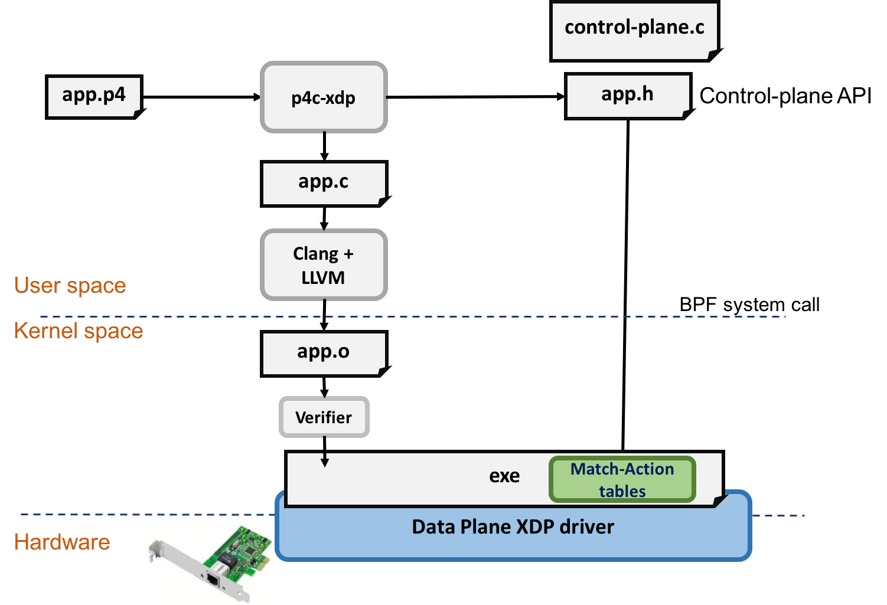

# p4c-xdp
[](https://github.com/vmware/p4c-xdp/actions/workflows/test.yml)
[](https://github.com/vmware/p4c-xdp/blob/master/LICENSE)
[](https://github.com/vmware/p4c-xdp/blob/master/lib/COPYING)

This work presents a P4 compiler backend targeting XDP, the eXpress Data Path.
P4 is a domain-specific language describing how packets are processed by the
data plane of a programmable network elements, including network interface
cards, appliances, and virtual switches.  With P4, programmers focus on
defining the protocol parsing, matching, and action executions, instead
of the platform-specific language or implementation details.

XDP is designed for users who want programmability as well as performance.
XDP allows users to write a C-like  packet processing program and loads into
the device driver's receiving queue.  When the device observes an incoming
packet, before hanging the packet to the Linux stack, the user-defined XDP
program is triggered to execute against the packet payload, making the
decision as early as possible.

We bring together the benefits of the two: P4 and XDP.  To get started,
first you need to setup the P4-16 compiler, then this project
is an extension to the P4-16. To execute the XDP, you need Linux kernel
version >= 4.10.0-rc7+ due to some BPF verifier limitations

<p align="center">
  
</p>

## Presentations
- IOVisor Summit 2017
[slides](https://github.com/vmware/p4c-xdp/blob/master/doc/p4xdp-iovisor17.pdf),
[demo1](https://youtu.be/On7hEJ6bPVU), [demo2](https://youtu.be/vlp1MzWVOc8), [demo3](https://youtu.be/TibGxCXPNVc)
- Linux Plumbers' Conference 2018
[slides](https://github.com/vmware/p4c-xdp/blob/master/doc/p4c-xdp-lpc18-presentation.pdf),
[paper](https://github.com/vmware/p4c-xdp/blob/master/doc/lpc18.pdf)

## Installation
### Docker/Vagrant
Please see Dockerfile. There is also a public docker image available as u9012063/p4xdp
```bash
$ docker pull u9012063/p4xdp
```
will pull the latest image. However, the XDP BPF code has dependency on your kernel version.
Currently for some complicated cases we require kernel >= 4.10.0-rc7.  So a vagrant box is
also provided with kernel 4.10.0-rc8.
```bash
$ vagrant init u9012063/p4xdp
$ vagrant up
$ vagrant ssh
ubuntu@ubuntu-xenial:~$ sudo su
root@ubuntu-xenial:/home/ubuntu# docker images
REPOSITORY          TAG                 IMAGE ID            CREATED             SIZE
u9012063/p4xdp      latest              3c77fbbd84e5        41 hours ago        2.469 GB
root@ubuntu-xenial:/home/ubuntu# docker run -it -u root --privileged <IMAGE ID>
```
Will boot this VM, pull the docker image, and you can try p4c-xdp.

### P4-16 Compiler
First you need to follow the installation guide of [P4-16](https://github.com/p4lang/p4c/)
When you have P4-16 compiler, then add this project as an extension.
Assuming you have P4-16 at your dir  ~/p4c/, to setup P4C-XDP:
```bash
cd ~/p4c/
mkdir extensions
cd extensions
git clone https://github.com/vmware/p4c-xdp.git
ln -s ~/p4c p4c-xdp/p4c
```
Now that you have cloned p4c-xdp at ~/p4c/extensions/p4c-xdp, the next step is to
recompile p4c:
```bash
cd ~/p4c/
mkdir -p build
cd build/
cmake ..
make
```
This generates a p4c-xdp binary in ~/p4c/build. And install the xdp test target
in `backends/ebpf/targets`.
Next create a soft link to the binary:
```bash
cd ~/p4c/extensions/p4c-xdp
ln -s ~/p4c/build/p4c-xdp p4c-xdp
```
And a soft link to the test runtime:
```bash
cd ~/p4c/extensions/p4c-xdp
ln -s ~/p4c/backends/ebpf/run-ebpf-test.py run-ebpf-test.py

```
Now you can run the p4c-xdp tests:
```
cd ~/p4c/build/
make check-xdp
```
This will check your llvm and clang version,
compile all .p4 files, generate .c files, and load them into the kernel
to be checked by the BPF verifier.

## XDP: eXpress Data Path
XDP is a packet processing mechanism implemented within the device driver with eBPF.
Currently to compile a P4 to C program, use
```bash
	# ./p4c-xdp --target xdp -o <output_c_file> <input_p4>
	./p4c-xdp --target xdp -o /tmp/xdp1.c xdp1.p4
```
then you need to compile the xdp1.c to eBPF bytecode, xdp1.o, then load it
into your driver. To compile a single .c file
```bash
clang -Wno-unused-value -Wno-pointer-sign \
		-Wno-compare-distinct-pointer-types \
		-Wno-gnu-variable-sized-type-not-at-end \
		-Wno-tautological-compare \
		-O2 -emit-llvm -g -c /tmp/xdp1.c -o -| llc -march=bpf -filetype=obj -o /tmp/xdp1.o
```
Then load it into the driver with XDP support
```bash
    ip link set dev $DEV xdp obj xdp1.o verb
```
to unload the XDP object
```bash
    ip link set dev $DEV xdp off
```
## Sample Code
Please see the [tests folder](https://github.com/vmware/p4c-xdp/tree/master/tests)
Simply run 'make' will start the build

## Related BPF/XDP work
 * Dive into BPF: a list of reading material, Quentin Monnet [link](https://qmonnet.github.io/whirl-offload/2016/09/01/dive-into-bpf/)
 * BPF: Next Generation of Programmable Datapath by Thomas Graf, OVS Conf 2016 [video](https://www.youtube.com/watch?v=QJfmmoH2nSQ&t=1046s)
 * Fast Programmable Networks & Encapsulated Protocols, David S. Miller, netdev 1.2 [video](https://www.youtube.com/watch?v=NlMQ0i09HMU)

## License
The p4c-xdp/lib/\* contains BPF loader licensed under the [General Public License, Version 2.0](lib/COPYING). The rest of p4c-xdp components are licensed under the [Apache License, Version 2.0](LICENSE).

## TODO
* Remove the private kernel patch requirement when latest kernel with BPF fixed is ready
* Apply the workaround of BPF\_MAX\_STACK
* Control plane example using perf\_event\_output
